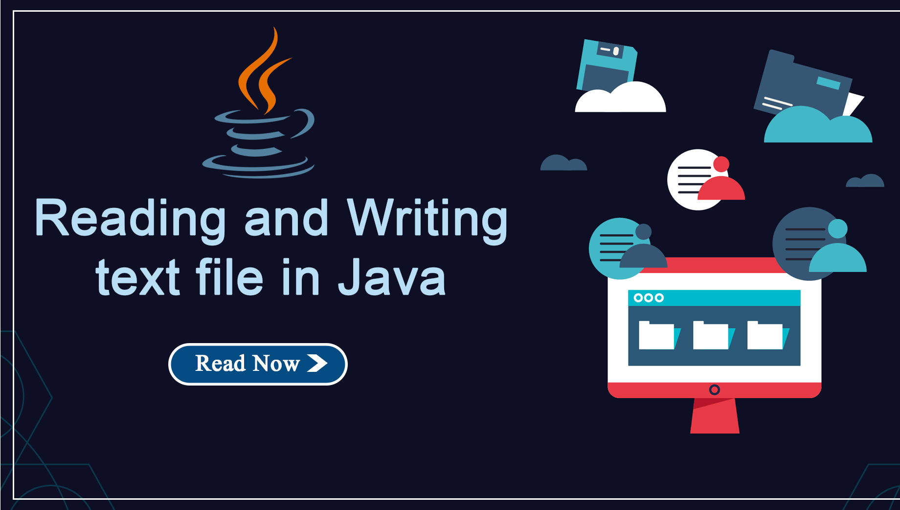
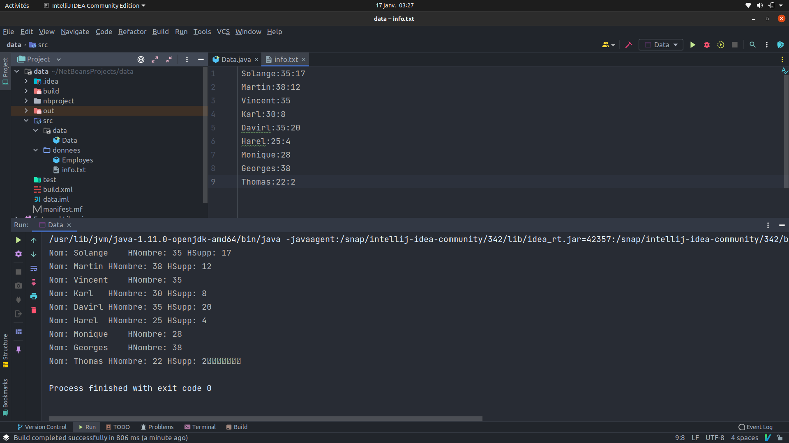

##### Data
    Description: Read, write data and manage files with java
    Author: HOUNSI Antoine
    Date: 13/01/22

##### **Doing**
- Read the info.txt file
- write the read content in the standard output
- Perform the algorthm by using right class

---
##### **EXPLANATIONS**
###### why **_`StringBuilder`_** than **_`String`_**
    String is immutable it mean that when you try to add a new char[]
    to an exiting, the oldest is overwrite...But StringBuilder is mutable.
    the use of StringBuilder help us to improve preformances.

######  **_`StringTokenizer`_** than **_`String.split()`_**
    The simple reason is instead of using String we use StringBuilder

---
##### **OUTPUT**

